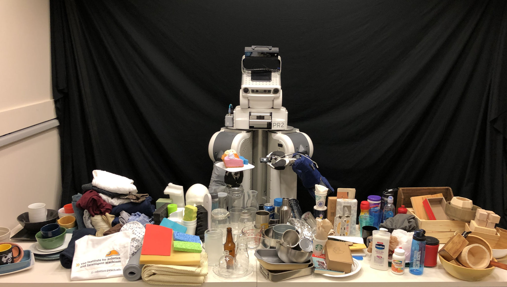

# SpectroVision
The SpectroVision dataset and associated code for the paper "Multimodal Material Classification for Robots using Spectroscopy and High Resolution Texture Imaging"



## Install
```bash
git clone https://github.com/Healthcare-Robotics/spectrovision.git
cd spectrovision
# Setup a virtual python environment to install requirements
python3 -m pip install --user virtualenv
python3 -m venv env
source env/bin/activate
pip3 install -r requirements.txt
```

## Download SpectroVision Dataset
Download the processed image and spectral data used for training neural network models:
```bash
wget -O dataset/spectrovision_dataset.zip https://github.com/Healthcare-Robotics/spectrovision/releases/download/1.0/spectrovision_dataset.zip
unzip dataset/spectrovision_dataset.zip -d dataset
```
Download the raw images and spectral measurements:
```bash
wget -O dataset/spectrovision_raw_dataset.zip https://github.com/Healthcare-Robotics/spectrovision/releases/download/1.0/spectrovision_raw_dataset.zip
unzip dataset/spectrovision_raw_dataset.zip -d dataset
```

## Retrain Networks (recompute results from paper)
Note: These computations will take a long time. Computing leave-one-object-out results for a training set of 104 material objects requires training 104 neural networks.
```bash
python3 main.py
```
Results are currently averaged over 10 seeds (which takes 10 times as long). If you wish to use only a single seed to speed up result computations (at the risk of large variation in results), you can use the following command:
```bash
python3 main.py --seed 8000
```
You may also run the script in the background using nohup. This is especially helpful when computing results on a remote machine.
```bash
nohup python3 main.py > results.out &
```

